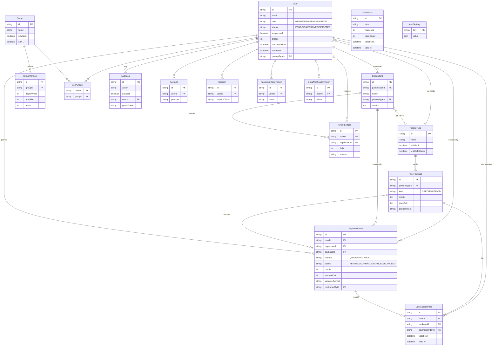

# Stěna Letňák Tišnov — technická specifikace

Tenhle dokument popisuje **co appka dělá a jak je postavená** — architekturu, datový model
a klíčové workflow. Pro **jak se s repem/větvemi pracuje** (propagace změn, ověřování,
D1-vs-Postgres rozdíly, deploy pravidla) viz [`CLAUDE.md`](../CLAUDE.md); pro rychlý přehled
a seznam funkcí [`README.md`](../README.md).

## Přehled

Webová appka pro správu vstupu na lezeckou stěnu: členové se zaregistrují, dobijí si kredity nebo
permanentku a otevřou si vstupní bránu appkou. Obsluha u stěny může ověřit permanentku QR kódem.
Admin spravuje uživatele, skupiny/rozvrhy, ceník, platby, guest passy a nastavení zámku.

**Stack:** React Router v7 (framework mode, Vite), Prisma ORM, Tailwind v4, i18next (CS/EN).
Běží nativně na Cloudflare Workers (`@cloudflare/vite-plugin`) nebo jako kontejner (Node/Docker) —
viz "Nasaditelné varianty" níže.

## Architektura větví

Appka je rozdělená mezi git větve podle databázového backendu — sdílené UI/byznys logika na
`app`, konkrétní DB napojení na `stena-*` větvích:

| Větev | Role |
|---|---|
| `app` | Celá appka — routy, komponenty, byznys logika, auth, i18n. Bez konkrétního DB klienta. |
| `stena-d1sql` | Dev varianta pro **Cloudflare D1** (Workers runtime). |
| `stena-d1sql-prod` | Produkční D1 varianta — nasazená na `stenatisnov.app`. |
| `stena-psql` | Dev varianta pro **PostgreSQL**, spustitelná v Dockeru, nasazovaná na Railway. |

Databázový rozdíl není jen "jiný connection string" — D1 nepodporuje Prisma interaktivní
transakce, takže `src/lib/gate.ts` a `src/lib/payments.ts` mají na D1 větvích jinou (atomickou
"claim-then-compensate") implementaci než na Postgres větvích (skutečné `$transaction`). Detaily
a důvody v [`CLAUDE.md`](../CLAUDE.md).

## Datový model

Schéma (`prisma/schema/models.prisma`) je sdílené napříč všemi DB variantami.

`Account`/`Session`/`VerificationToken` (bez vazby zde, samostatná tabulka bez FK) jsou NextAuth
Prisma-adaptérové artefakty — appka má vlastní cookie session (`session.server.ts`), tyhle tabulky
existují jen kvůli kontraktu adaptéru a `Account` reálně slouží pouze pro Google OAuth link.
`AppSetting` a `GuestPass` nemají cizí klíče, proto v diagramu nemají žádnou spojnici.

Hlavní oblasti:

### Uživatelé a přihlášení

- **`User`** — `role` (`MEMBER`/`STAFF`/`ADMIN`/`ROOT`), `status` (`PENDING`/`APPROVED`/`REJECTED`),
  `suspended`, `credits`, `cooldownUntil` (blokuje opětovné otevření brány po posledním vstupu),
  `personTypeId` (cenová kategorie), `birthDate` (věkový gate při registraci).
- **`Dependent`** — doprovod (typicky dítě) vedený pod účtem rodiče, bez vlastního přihlášení;
  má vlastní `credits` a `personTypeId`, ale vstupy/platby se vždy dějí přes rodičovo přihlášení.
- **`Account`**/`Session`/`VerificationToken`** — NextAuth-kompatibilní tabulky (OAuth link na
  Google, DB session kontrakt) — appka má vlastní hand-rolled cookie session
  (`src/lib/session.server.ts`), tyhle tabulky přežily z historie kvůli Prisma adaptéru.
- **`PasswordResetToken`**, **`EmailVerificationToken`** — jednorázové tokeny pro obnovu hesla
  a ověření e-mailu po registraci.

### Řízení přístupu (kdo, kdy)

- **`Group`** + **`GroupWindow`** — skupina má týdenní časová okna (den + `fromMin`/`toMin`
  v minutách od půlnoci) nebo `is24_7` flag; brána se otevře, pokud má uživatel aktivní okno
  v *libovolné* své skupině právě teď. Nová registrace se automaticky přidá do skupiny
  s `isDefault: true`.
- **`UserGroup`** — M:N vazba uživatel↔skupina.
- **`PersonType`** — cenová kategorie (např. "Dospělý", "Dítě") — určuje, jaké `PricePackage`
  se uživateli/doprovodu nabízí. `visibleToUsers: false` znamená, že typ může přiřadit jen admin
  (Administrace → Uživatelé), ne uživatel sám (např. při zakládání doprovodu).

### Ceník a platby

- **`PricePackage`** — buď `CREDITS` (počet vstupů za cenu) nebo `PERIOD` (časová permanentka —
  `WEEK`/`MONTH`/`YEAR`/`CUSTOM` s explicitním `periodFrom`/`periodTo`).
- **`PaymentOrder`** — jedna platební objednávka; `method` (`QR`/`GOPAY`/`MANUAL`), `status`
  (`PENDING`→`CONFIRMED`/`CANCELLED`/`FAILED`). `dependentId` nastavený znamená, že rodič kupoval
  balíček pro doprovod, ne pro sebe. Potvrzení (`confirmPaymentOrder` v `src/lib/payments.ts`)
  buď přičte kredity, nebo (u `PERIOD` balíčku) založí `UserAccessPass`.
- **`UserAccessPass`** — časová permanentka: `validFrom`/`validTo` okno, ve kterém appka pouští
  bránu bez ohledu na stav kreditů.
- QR platba se páruje automaticky podle variabilního symbolu (Fio banka polling, viz
  `src/lib/fio.ts`); GoPay běží přes webhook (`api/gopay/webhook`); `MANUAL` je ruční potvrzení
  adminem na `/admin/payments`.

### Kredity a audit

- **`CreditLedger`** — append-only historie každé změny kreditů (nákup +, vstup na stěnu -1,
  ruční admin úprava ±, rollback po selhání zámku). `dependentId` rozlišuje, jestli šlo o kredity
  rodiče nebo doprovodu (řádek je vždy navázaný na `userId` rodiče kvůli dohledatelnosti).
- **`AuditLog`** — obecný log úspěšných i neúspěšných akcí (přihlášení, vstupy, platby, admin
  změny) s CSV exportem v `/admin/logs`.

### Guest passy

- **`GuestPass`** — vstupenka nenavázaná na žádný účet; token, platnost (`validFrom`/`validTo`),
  `maxUses`/`usedCount`. Vytváří admin na `/admin/guests`, používá se přes `/guest/:token`.

### Nastavení

- **`AppSetting`** — generický key/value JSON store pro vše admin-konfigurovatelné: `lock`
  (zámek/EVOK agent URL+token), `qrPayment` (bankovní účet pro QR platby), `gopay`
  (GoPay credentials), `googleOAuth` (Google client ID/secret + zapnuto/vypnuto), `smtp`, `s3`
  (zálohy), `fio` (bankovní API token pro auto-párování plateb), `registration`
  (věkové/schvalovací pravidla), `notifications`, `paymentControl`, `wcCode`,
  `logCleanup`/`pendingOrderCleanup`/`emailVerification` (plánované úklidové úlohy),
  `paymentReceipt` (PDF potvrzenky), `backup`/`transactionBackup`/`databaseDump` (S3 zálohy).

## Struktura kódu

- **`app/routes.ts`** — mapa všech routes. Členské: `/`, `/buy`, `/account`, `/navod`,
  `/verify-email`, `/reset-password`, `/complete-profile`, `/guest/:token`. Personál:
  `/verify-pass`, `/payment-check`, `/set-person-type`, `/navod-staff`. Admin (`/admin/*`):
  `users`, `groups`, `pricing`, `payments`, `guests`, `stats`, `login-qr`, `settings`, `logs`,
  `data` — `settings`/`logs`/`data` jsou vyhrazené jen pro `ROOT` (`src/lib/admin-nav.ts`).
  Resource routes bez UI (`/api/*`) obsluhují Google OAuth callback a GoPay webhook.
- **`src/lib/*.ts`** — byznys logika bez závislosti na konkrétní routě: `gate.ts`
  (`openGateForUser`/`openGateForGuest` — atomické odečtení kreditu + volání zámku),
  `payments.ts` (`confirmPaymentOrder`), `roles.ts` (hierarchie oprávnění), `session.server.ts`
  (cookie auth), `settings.ts` (typované gettery pro `AppSetting`), `schedule.ts`
  (`isWithinWindows`), `mail.ts`/`registration-mail.ts` (e-maily), `receipt-pdf.ts` (PDF
  potvrzenky plateb), `data-transfer.ts`/`db-dump.ts` (YAML/SQL export-import), `stats.ts`
  (grafy na `/admin/stats`), `fio.ts` (bankovní polling), `lock.ts` (HTTP komunikace se zámkem).
- **`src/lib/actions/*.ts`** — server actions volané z routes (`auth.ts`, `gate.ts`,
  `payments.ts`, `staff.ts`, `admin-*.ts`) — tenká vrstva nad `src/lib/*.ts`, řeší jen
  auth/validaci vstupu a mapování na `intent`-based form dispatch (jedna routa, víc akcí přes
  skryté pole `intent`).
- **`messages/{cs,en}.json`** — i18next překlady, `guide`/`guideStaff` sekce zrcadlí
  `app/routes/navod.tsx`/`navod-staff.tsx` (a `docs/generate-navod-pdf.py`, viz níže).

## Klíčové workflow

### Registrace a schválení

Formulář (jméno, e-mail, telefon, datum narození, heslo) **nebo** jedním klikem přes Google OAuth
(`isGoogleOAuthEnabled` — admin-konfigurovatelné, viz `googleOAuth` setting). Google registrace
přeskočí heslo i ověřovací e-mail. Datum narození věkově gatuje účet (`registration` setting —
pravidla pro nezletilé). Nový účet má `status: PENDING`, dostane se do výchozí skupiny
(`Group.isDefault`); admin ho schválí na `/admin/users` (→ `APPROVED`) nebo zamítne.

### Přihlášení a session

E-mail/heslo (bcrypt) nebo Google. Session je podepsaný cookie (`createCookieSessionStorage`,
`AUTH_SECRET`) obsahující jen `userId` — role/status/suspended se čtou z DB při každém requestu
(`session.server.ts`), takže admin změna (schválení, suspendace, změna role) se projeví okamžitě
bez nutnosti nového přihlášení.

### Vstup na stěnu (gate entry)

Na dashboardu member odsouhlasí provozní řád, volitelně zaškrtne doprovod(y), pak klikne na
vstupní tlačítko — appka nabídne dialog se třemi možnostmi:

1. **Prokázat se obsluze** — zobrazí QR kód (e-mail, případně + ID vybraných doprovodů) k
   naskenování obsluhou na `/verify-pass`, která teprve tam odečte vstup.
2. **Otevřít bránu** — jen pokud je zámek dostupný (`checkGateOnlineAction`); po potvrzení
   (yes/no) appka rovnou zavolá `openGateForUser` a odemkne.
3. **Storno.**

`openGateForUser`/`openGateForGuest` (`src/lib/gate.ts`) atomicky ověří a odečtou kredit (nebo
zkontrolují platnou `UserAccessPass`) — implementace se liší D1 vs. Postgres, viz
[`CLAUDE.md`](../CLAUDE.md). Selhání zámku po odečtení kreditu kredit vrátí (rollback). ADMIN/ROOT
mají neomezený vstup (`hasFreeGateEntry`), STAFF vstupuje jako MEMBER.

Mimo balíčky lze zaplatit i **okamžitě jen za jeden vstup** — appka vygeneruje QR platbu na
místě bez nutnosti kupovat balíček předem.

### Nákup kreditů/permanentky

`/buy` — výběr `PersonType` (sebe nebo doprovodu přes "Pro koho"), pak balíček. QR platba
vygeneruje SPD QR kód s variabilním symbolem; potvrzení buď automaticky (Fio banka polling
najde platbu podle VS) nebo ručně adminem na `/admin/payments`. GoPay běží přes redirect +
webhook. Potvrzení `PaymentOrder` je atomické "claim" (`status: PENDING` v `WHERE`) kvůli
souběhu ručního potvrzení a Fio pollu.

### Doprovod (companions)

Na `/account` člen přidá doprovod (jméno + `PersonType`, jen typy s `visibleToUsers: true`).
Doprovod nemá účet ani heslo. Nákup balíčku i vstup na bránu se pro doprovod dějí přes rodičovo
přihlášení — na `/buy` přepnutím "Pro koho", na vstupním tlačítku zaškrtnutím.

### Guest passy

Admin vytvoří token s platností a max. počtem použití na `/admin/guests`; návštěvník otevře
`/guest/:token` a vstoupí bez účtu.

### Admin operace

`/admin/*` (ADMIN+): uživatelé (schvalování, role, suspendace), skupiny/rozvrhy, ceník, ruční
potvrzení plateb, guest passy, statistiky s grafy. Jen ROOT: nastavení (zámek/platby/SMTP/S3/...),
audit log s CSV exportem, export/import dat (YAML config, SQL dump zálohy).

## Tištěné/in-app návody

`app/routes/navod.tsx` (členové) a `navod-staff.tsx` (obsluha) jsou in-app HTML verze; tištěný PDF
manuál (`docs/navod-clenove.pdf`, generovaný z `docs/generate-navod-pdf.py` +
`docs/_pdf_common.py`) je jeho ručně udržovaná zrcadlová kopie — při změně obsahu jednoho je
potřeba ručně promítnout i do druhého, negenerují se navzájem automaticky.
